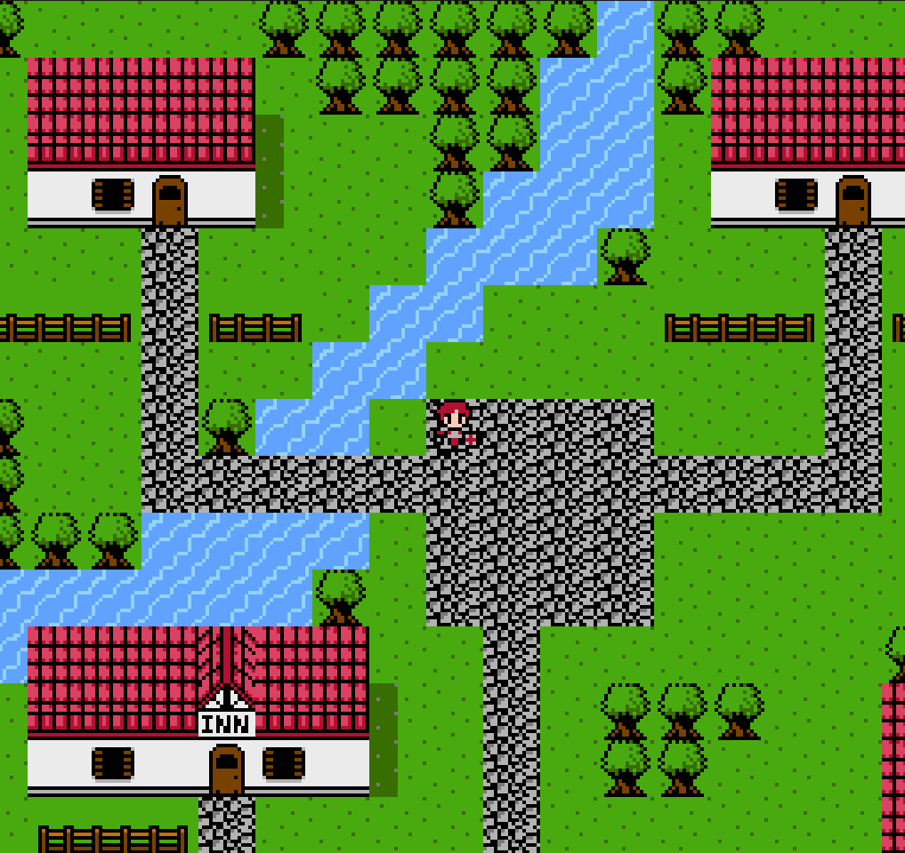

# Open Fantasy

A JRPG written in raw x86_64 assembly for Linux.



## Why

I've been playing the original *Final Fantasy* on NES, which, like most
games from that era, was written in assembly by hand. These days AI can
write most of your code for you, so as a personal flex and a bit of
catharsis, I'm building a JRPG entirely in x86_64 assembly instead. No
engine, no scripting layer, just syscalls, registers, and stack frames.

## Rules I'm setting for myself

- The game logic, rendering, sprites, audio playback, everything that makes
  this *a game*, is written by me, by hand, in assembly.
- I'm allowing myself a small set of C libraries for the stuff that isn't
  worth reinventing (windowing, graphics context, OS differences):
  - [GLFW](https://www.glfw.org/) — window/context/input handling
  - [miniaudio](https://miniaudio.dev/) — audio playback (planned, not wired
    up yet)
- Everything else (sprite rendering, tile/map rendering, animation, input,
  entities, whatever a JRPG needs) is hand-rolled assembly.

## Platform

Currently Linux only (System V x86_64, raw syscalls for I/O/exit). Windows
support is a maybe-later.

## Building

Requires `nasm` and `ld`, plus GLFW and OpenGL development libraries
installed on the system.

```sh
make        # build bin/fantasy
make run    # build and run
make clean  # remove build/ and bin/
```

## Layout

```
src/                     game source (assembly)
  fantasy.asm              entry point, GL/GLFW setup, and main loop
  constants.inc             shared constants (key codes, speeds, etc.)
  input.asm                 keyboard input handling
  playerOverworld.asm       player state machine and overworld movement
  renderer.asm               framebuffer/texture rendering
  spriteAnimation.asm       fixed-point sprite animation frame stepping
  sprites.asm                packed 2bpp character sprites and palettes
  tileset.asm                 packed 2bpp tile sprites and palettes
  maps.asm                    map/tilemap data
  utils.asm                   string, syscall, and misc helpers
build/                   object files (gitignored)
bin/                     final binary (gitignored)
```
